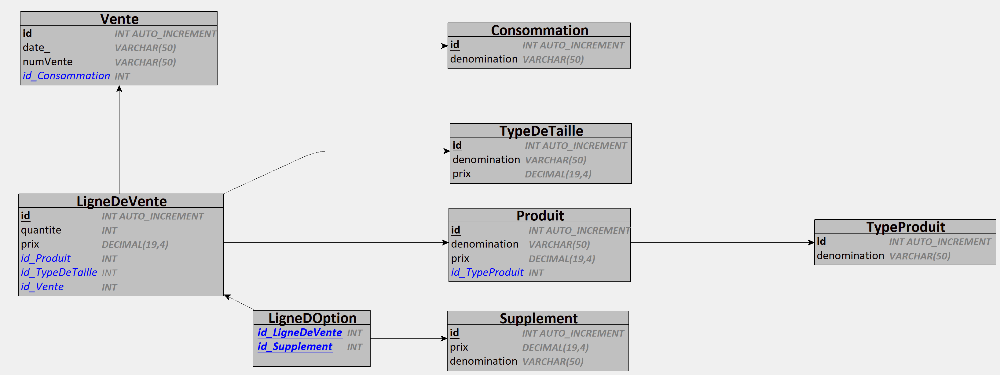
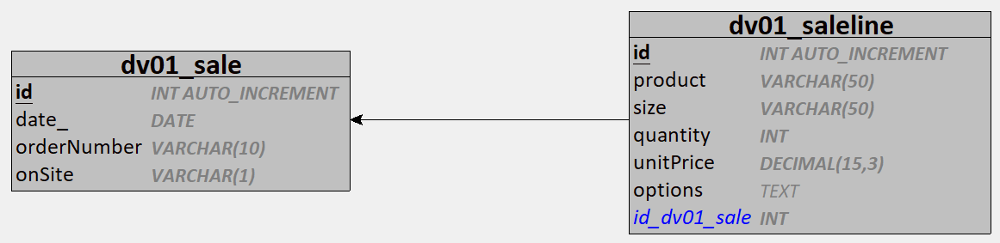

# Vente Pizza

# Ajoût d'une couche d'abstraction de base de données

# Made with ❤️ by [JAD](mailto:jeanaymeric@gmail.com)

## DB ventepizza :

Voici le MCD de la base de données ventepizza :


Et voici le MLD :


### Une petite explication des différentes entités :

- **Consommation** : représente le type de consommation (sur place ou à emporter)
- **Vente** : représente une vente
- **LigneDeVente** : représente une ligne de vente (le prix est le prix unitaire en fonction de la taille si présente et
  des suppléments si présents)
- **Produit** : représente un produit.
- **TypeDeTaille** : représente la taille d'un produit (petite, moyenne, grande). La taille n'est présente que pour les
  pizzas.
- **Supplément** : représente un supplément (fromage, champignons, jambon, etc.). Les suppléments ne sont présents que
  pour les pizzas. Il peut y avoir 4 suppléments maximum par pizza.
- **TypeProduit** : représente le type de produit (pizza, boisson, dessert)

Vous pouvez installer cette base de données sur votre serveur MySQL en exécutant le script `ventepizza-start.sql` situé
dans le dossier `sql\script`.

Pour vous faciliter le travail (je sais, je sais, je suis trop gentil), je vous ai fait un script Python qui s'en
charge. Il vous suffit d'exécuter la commande suivante :

```shell
python start.py
```

## Objectif :

### Vues à créer :

Voici les 2 vues que vous devez créer :


#### dv01_Sale :

- `id` : vente.id
- `date` : vente.date
- `orderNumber` : vente.numVente
- `onSite` : 'Y' si consommation.denomination = 'Sur place' et 'N' si consommation.denomination = 'A emporter'

#### dv01_SaleLine :

- `id` : ligneDeVente.id
- `product` : produit.denomination
- `size` : typeDeTaille.denomination
- `quantity` : ligneDeVente.quantite
- `unitPrice` : ligneDeVente.prix
- `options` : concaténation de tous les suppléments séparés par des virgules

### Procédures stockées à créer :

- `getAllSaleLines()` : retourne toutes les lignes de vente (`id`, `date`, `orderNumber`, `onSite`)
- `getSaleById(id)` : retourne une vente par son id (`id`, `date`, `orderNumber`, `onSite`)
- `getAllSaleLines()` : retourne toutes les lignes de
  vente (`id`, `product`, `size`, `quantity`, `unitPrice`, `options`)
- `getSaleLineById(id)` : retourne une ligne de vente par son
  id (`id`, `product`, `size`, `quantity`, `unitPrice`, `options`)
- `createSale(orderNumber varchar(10), onSite varchar(1))` : crée une vente à la date du jour
- `addSaleLine(orderNumber varchar(10), product varchar(50), size varchar(10), quantity int, option1 varchar(50), option2 varchar(50), option3 varchar(50), option4 varchar(50))` :
  ajoute une ligne de vente à une vente

## Validation

Des tests unitaires sont fournis pour valider votre implémentation.
Pour que vos modifications de base de données soient prises en compte, vous devez effectuer un dump un peu spécifique.
Pour cela exécuter le script python :

```shell
python create_dump.py
```

Et ensuite, faîtes votre `commit and push`, les tests sont exécutés automatiquement par GitHub Actions.

Au départ, tous les tests échouent, c'est normal. Vous devez modifier la base de données pour que les tests passent.

Pour visualiser les résultats des tests, cliquez sur l'onglet `Actions` de votre dépôt GitHub.
Cliquez ensuite `jad-autograding` pour voir le détail des tests.
